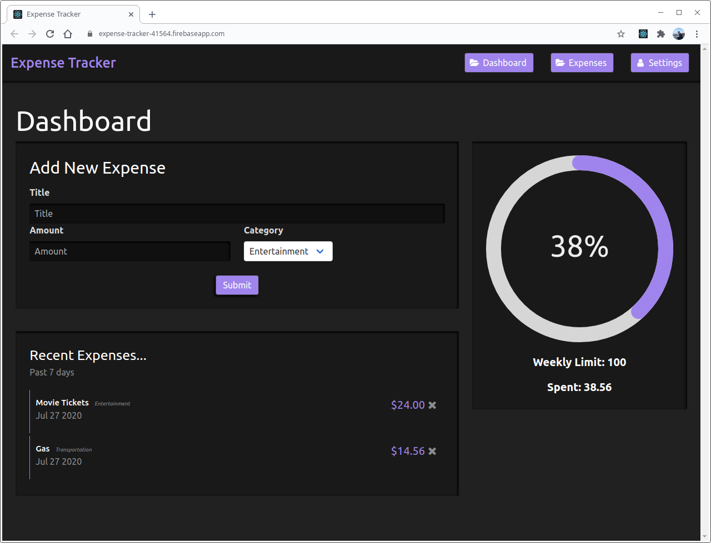

# Expense Tracker
<a href="https://expense-tracker-41564.firebaseapp.com/">Expense Tracker</a> is an easy to use tool for keeping track of your spending. You can set weekly spending limits as well as label all your expenses based on their category so you know exactly where your biggest spending habits lie. 
	
## Tech
The front end interface was built with React, utilizing the React Context api for state management. For data storage and authorization I used Firebase. This allowed me to quickly set up email and google log in. Lastly, I used Bulma for general styling and the grid layout, later building my own style and look on top of that.

## Preview
